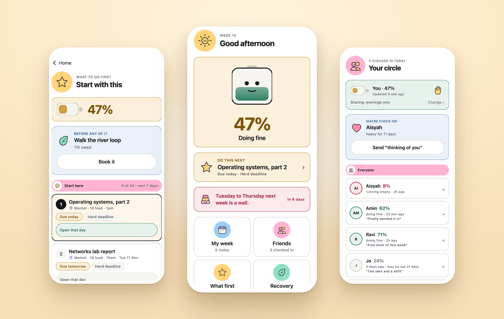
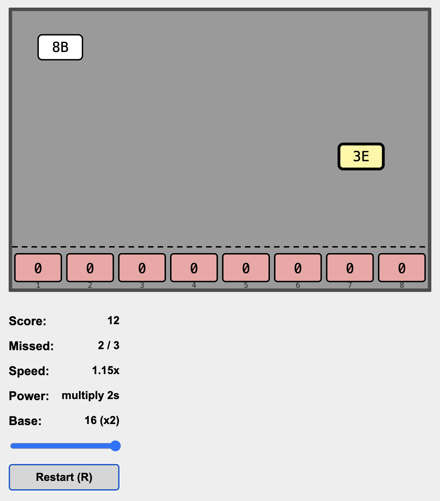
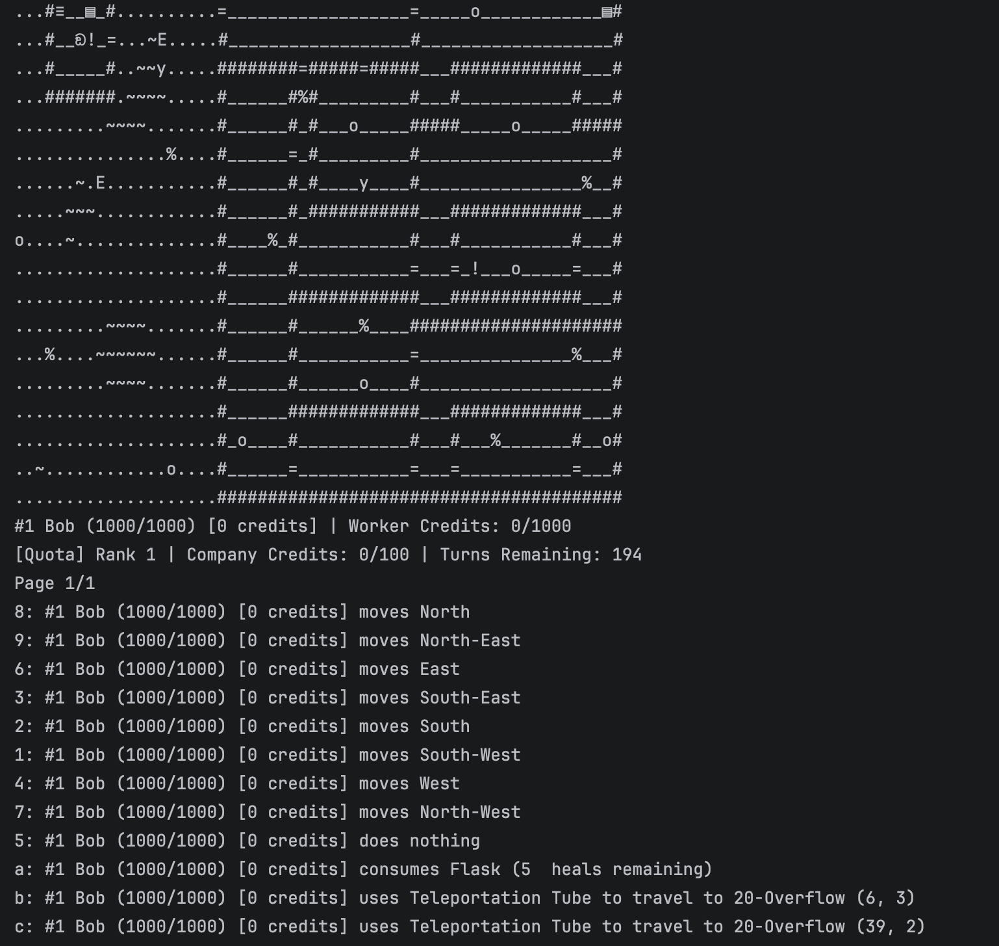
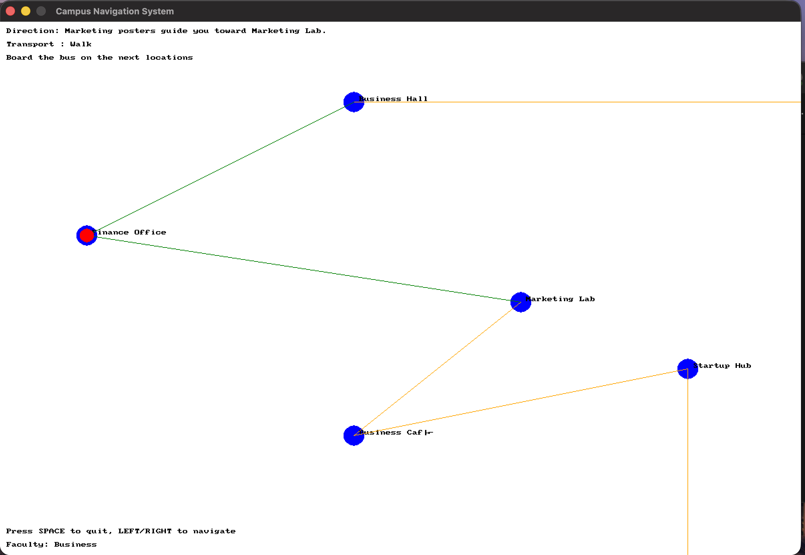

# Hi 👋, I'm Chan Kin Chung

### Year 2 CS student

- 🔭 I'm currently working on **Student, passionate on full stack development and AI engineer**

- 🌱 I'm currently learning **Functional Programmming and DSA**

- 👯 I'm looking to collaborate on **Software developer internship**

- 📫 How to reach me **kcchung82@gmail.com**

<h3 align="left">Connect with me:</h3>

<h3 align="left">Languages and Tools:</h3>

                     

---

## 🚀 Featured Projects

### ⚓ Ballast &nbsp;·&nbsp; <b>CodeNection Hackathon 2026 — Finalist 🏆 &nbsp;·&nbsp; currently in the building phase 🚧</b>

**A stress and workload manager for students who are already too busy to manage their stress.**

Every task is scored as **`load = time × dread`** — because an hour you are dreading costs more than an hour
you are not. That one idea lets Ballast see a bad week coming *before* it lands, and name the specific things
you could put down to survive it.

**Highlights**

- 🔋 **One honest number, and five areas underneath it** — a group presentation is not just "mental", it is mental *and* time *and* a social cost nobody would have thought to name. Ballast shows **which part of you** is overflowing, not just how full you are.
- 🌊 **A 14-day forecast that warns you early** — *"Tuesday to Thursday next week is a wall. In 8 days."* Eight days is enough time to do something about it; the night before is not.
- ⚖️ **Rebalance offers a trade, not a lecture** — keep one, drop the other, with attendance arithmetic deciding which classes you can actually afford to miss — then it writes the awkward message for you.
- 👥 **A circle that shares a battery, not a calendar** — a charge, a band, and one line they wrote themselves. Never a task, a deadline or a module. Free evenings only if you choose to publish them.
- 📴 **Runs on the phone, offline, one tap a day** — the planner is a deterministic algorithm rather than a chatbot, so the same week always produces the same advice.

  
  
  

<code>React Native</code> <code>Expo</code> <code>Product Design</code> &nbsp;·&nbsp; prototype built with AI-assisted development.

---

<table>
  <tr>
    <td width="50%" valign="top">
      
    </td>
    <td width="50%" valign="top">
      <h3>🎯 Flippy Bit</h3>
      <b>August 2026</b>
      

        A real-time browser game built in <b>TypeScript</b>, where user input and game
        ticks are modelled as composed <b>RxJS streams</b>. Falling hex values have to be
        matched by flipping the right bits before they reach the floor.
      

      
<b>Highlights:</b> keyboard input and timing composed as reactive observables ·
      immutable state threaded through a single reducer · pure functions for deterministic,
      side-effect-free, testable logic · difficulty scaling and power-ups · unit tested with Vitest

      

        <code>TypeScript</code> <code>RxJS</code> <code>FRP</code> <code>Vite</code> <code>Vitest</code>
      

      

        
      

    </td>
  </tr>
  <tr>
    <td width="50%" valign="top">
      <h3>🎮 Rogue-like Adventure Game</h3>
      <b>June 2026</b>
      

        A turn-based <b>rogue-like</b> set on a decommissioned space station, built in
        <b>Java</b> within a group of four. Extends a provided game engine with new maps,
        actors, items and terrain.
      

      
<b>Highlights:</b> UML class and sequence diagrams with documented design rationale ·
      SOLID and DRY applied throughout to maximise extensibility and maintainability ·
      element reaction system dispatched through enum overrides with no <code>instanceof</code> branching ·
      temporal rift mechanic that records and replays past events · JavaDoc and unit tests

      

        <code>Java</code> <code>OOP</code> <code>SOLID</code> <code>UML</code> <code>Design Patterns</code>
      

      

        
      

    </td>
    <td width="50%" valign="top">
      
    </td>
  </tr>
  <tr>
    <td width="50%" valign="top">
      
    </td>
    <td width="50%" valign="top">
      <h3>🗺️ Campus Navigation System</h3>
      <b>January 2026</b>
      

        A multi-modal campus route planner written in <b>C++</b>, pairing a custom
        <b>templated linked list</b> and file-based persistence with an interactive
        <b>SplashKit 2D map</b>.
      

      
<b>Highlights:</b> recursive backtracking with branch-and-bound pruning ·
      five route preferences (fastest, shortest, min-walk, bus-priority, comfort) ·
      traffic-weighted travel time across walking and bus legs · map data persisted to file ·
      terminal and graphical interfaces

      

        <code>C++</code> <code>SplashKit</code> <code>Data Structures</code> <code>Graph Algorithms</code>
      

      

        
      

    </td>
  </tr>
</table>
